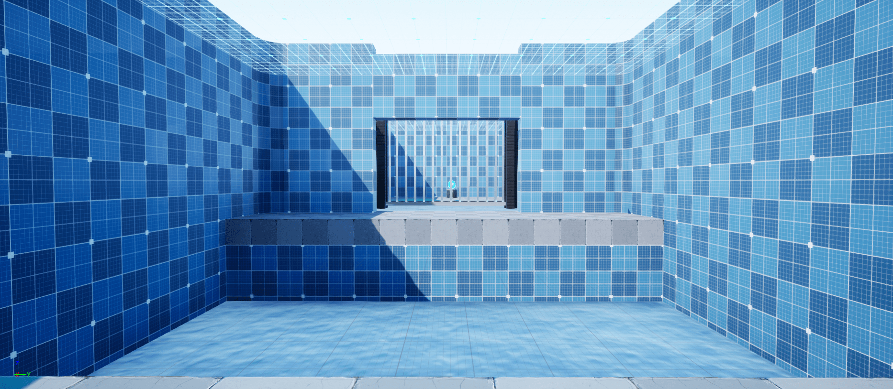

# UE4 - Zelda Breath of the Wild Sheikah Runes

  
   <b>Recreation of the 4 Sheikah Runes mechanics from Zelda Breath of the Wild using the Unreal Engine 4 (V4.25.3).</b>

## Introduction

This project features :
* Four distinct <b>Sheikah Runes</b> (Remote Bombs, Cryonis, Stasis, Magnesis) working gameplay mechanics.
* Complete <b>User Interface</b> working like the full game for each rune.
* <b>Basic melee combo system</b> for interacting with stasis objects.
* A <b>demo level</b> in the form of a Shrine, where you can test the abilities in four rooms and collect orbs.
* <b>Basic animations</b> and <b>VFX</b> made by a programmer.

## Basic Interactions

  
   <i>Link can carry and drop objects</i>

Those interactions are common for several objects. 
For now, Link can :
* Carry objects
* Drop objects
* Launch objects

The animation blueprint uses IK on both hands based on two sockets found in the object carried.

  
## Sheikah Runes preview 💣❄️🔒🧲

### Remote Bombs 💣

  
   <i>Link can make bombs explode remotely</i>

With the <b>Remote Bombs</b> rune, Link can create two bombs (one rounded and one squared). The bombs react like a carryable object, Link can drop and throw the bomb and then make them explode.

### Cryonis ❄️

  
   <i>Link can create ice pillar on water surfaces</i>

With the <b>Cryonis</b> rune, Link can create and destroy pillars on water surfaces. The system handles pillars created horizontally (from a cascade).

### Stasis 🔒

  
   <i>Link can hit froze objects to create momentum</i>

 
With the <b>Stasis</b> rune, Link can freeze objects in time, allowing him to create momentum by hitting them. He can then release them, making the momentum accumulated to launch the object with great force in the air.
  

### Magnesis 🧲

  
   <i>Link can carry any magnetic object</i>

  
 With the <b>Magnetic</b> rune, Link can carry big magnetic objects. He can pull or push the objects.
 
## User Interface
The project includes a working and faithful user interface, with several widgets, all animated.

  
   <i>Link can quickly select a rune via a carousel</i>

I designed the UI to be all event-driven by severals event dispatchers to isolate each system. 

## Demo Shrine

  
   <i>Preview of the room for the <b>Cryonis</b> rune</i>

For testing purposes, a little Demo Shrine is included in the project. The player must face challenges to collect one orb for each rune, showing that the mechanics are working correctly.

## Work in Progress
* Add <b>sound effects</b> to the demo (I need to find audio resources online with the sounds from the game).
* Add <b>Post-process effects</b> for each rune that show a grid and make the screen tinted by the colour of the rune.
* Fix some bugs and tweak VFX 🐛

## Disclaimer
⚠️⚠️ The user interface uses the Nintendo Switch controller scheme. ⚠️⚠️

## Credits
* Animation System - [Advanced Locomotion System V4](https://www.unrealengine.com/marketplace/en-US/product/advanced-locomotion-system-v1)
* Hammer and Snowflake Icon by [Freepik](https://www.flaticon.com/authors/freepik)
* Sword animations from [mixamo](https://www.mixamo.com)
* Particle Pack by [Kenney](https://www.kenney.nl/assets/particle-pack)
* Arrow model from [Mix and Jam](https://www.youtube.com/channel/UCLyVUwlB_Hahir_VsKkGPIA)
* Ice material by [Dean Ashford](https://www.youtube.com/watch?v=sE64iTjnoUM)
* Rounded cube from [Acceloroto](http://acceleroto.com/2013/08/game-prototyping-rounded-cube-3d-model/)
* Additional UI elements from [Paul "Superfondue" Rey](https://www.instagram.com/superfondue/)
* Grid materials from [SuperGrid](https://www.unrealengine.com/marketplace/en-US/product/supergrid-starter-pack)
* All assets from Zelda Breath of the Wild are used for educational purposes only and are property of Nintendo (please don't strike me...)
